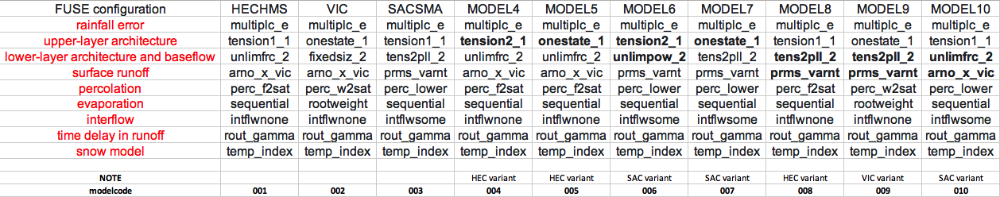

# Uncertainty partition 

A primer for partioning uncertainty in flood frequency estimates arising from three sources: forcing, parameters, and model structures.

## Multi-model structures
10 FUSE model structures are finalized.

## Calibration (100 ens, 10 models):

* New set-up is here: `/glade/work/manab/ff/1_calib`
* Job list and submission creation script: `0_createjobs.py`
    * Needs to be changed to `calib_sce` and then to `run_best` 
* Job submission: `1_qsubmit.sh` 

## Calibration results
* FDCs, yearly maxes, KGE distributions, and time series plots: `6_multimodel_calibresults.ipynb`
* Parameter distribution for different models: `7_plotParameters.ipynb`

## Parameter perturbation
