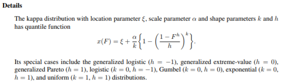

# Uncertainty partition 

A primer for partioning uncertainty in flood frequency estimates arising from three sources: forcing, parameters, and model structures.

## Target
* Precip growth curve distribution (?)
* Perturbed initial conditions 
* Model structures (10)
* Parameter sets (100 calibrated sets)
* ANOVA

## Multi-model structures
10 FUSE model structures are finalized.

## Forcing generation
* Go to `/d3/msaharia/ffreq/forcinggeneration` in Hydro-c1 server
* `python2.7 poly2poly/poly2poly.py  /d3/msaharia/ffreq/forcinggeneration/pilot_basin_data/IslandPark_WatershedDelineation.gpkg Id PNW/PNW_elev_0625_poly2.gpkg id GRID islandpark.nc`
* This creates the mapping file which will be used to generate the time series
* Creates the final input file: `python2.7 poly2poly.map_timeseries.py ../islandpark.nc /d3/hydrofcst/overtheloop/data/forcing/retro/forc_nc/PNW/ens_forc.PNW.0625.1980-1989.051.nc ../testme.nc`

## Calibration (100 ens, 10 models):

* New set-up is here: `/glade/work/manab/ff/1_calib`
* Job list and submission creation script: `0_createjobs.py`
    * Needs to be changed to `calib_sce` and then to `run_best` 
* Job submission: `qsub 1_qsubmit.sh` 

## Calibration results
* FDCs, yearly maxes, KGE distributions, and time series plots: [Notebook](6_multimodel_calibresults.ipynb)
* Parameter distribution for different models: [Notebook](7_plotParameters.ipynb)

## Parameter list
This is a list of all parameters in FUSE and temporary names used by scripts to perturb them

|Parameter Name | Alias   |
|---------------|---------|
| RFERR_ADD     |         |
| RFERR_MLT     |TEMPRFMLT|
| RFH1_MEAN     |         |
| RFH2_SDEV     |         |
| RH1P_MEAN     |         |
| RH1P_SDEV     |         |
| RH2P_MEAN     |         |
| RH2P_SDEV     |         |
| MAXWATR_1     |TEMPMAXW1|
| MAXWATR_2     |TEMPMAXW2|
| FRACTEN       |TEMPFRACT|
| FRCHZNE       |TEMPFRCHZ|
| FPRIMQB       |TEMPFPRIM|
| RTFRAC1       |TEMPFRAC1|
| PERCRTE       |TEMPPERCR|
| PERCEXP       |TEMPPERCE|
| SACPMLT       |TEMPSACPM|
| SACPEXP       |TEMPSACEX|
| PERCFRAC      |TEMPPERCF|
| FRACLOWZ      |TEMPFRACL|
| IFLWRTE       |TEMPIFLWR|
| BASERTE       |TEMPBASER|
| QB_POWR       |TEMPQBPOW|
| QB_PRMS       |TEMPQPRMS|
| QBRATE_2A     |TEMPQBR2A|
| QBRATE_2B     |TEMPQBR2B|
| SAREAMAX      |TEMPSAMAX|
| AXV_BEXP      |TEMPAXVBE|
| LOGLAMB       |TEMPLOGLA|
| TISHAPE       |TEMPTISHA|
| TIMEDELAY     |TEMPTIMED|
| MBASE         |TEMPMBASE|
| MFMAX         |TEMPMFMAX|
| MFMIN         |TEMPMFMIN|
| PXTEMP        |TEMPPTEMP|
| OPG           |TEMPOPGRA|
| LAPSE         |TEMPLAPSE|

### Number of parameters per model
|Model number   | Params  |
|---------------|---------|
|       1       |  15     |
|       2       |  17     |
|       3       |  19     |
|       4       |  17     |
|       5       |  15     |
|       6       |  20     |
|       7       |  19     |
|       8       |  18     |
|       9       |  19     |
|      10       |  16     |

## Parameter perturbation (Not reqd. currently)
* Using IQR ranges of the calibrated parameter sets, the values in the templates are replaced: `/glade/work/manab/ff/2_paramperturb/paramranges`
* The parameter file templates are here: `/glade/work/manab/ff/2_paramperturb/templates`
* The perturbation parameters are noted in the namelist: `namelist.sens.R`
* The parameter sets are generated using this `1_creates_paramsets_model1.R`
    * The complete parameter archive is stored here: `/gpfs/fs1/work/manab/ff/2_paramperturb/paramarchive`
    * The generated parameter files which will be used in further simulations are here: `/glade/work/manab/ff/2_paramperturb/paramfiles`
* *NOTE* Run all the param generation scripts using `./2_create_paramsets_allmodels.sh`

## Event forcings
An annual maximum precipitation-frequency analysis using the `lmom` package in R. The precip-frequency relationship takes the form of a 4-parameter kappa defined by

* The kappa parameters are fitted and corresponding 48-hour bin-wise precipitation totals are computed using: `/gpfs/fs1/work/manab/ff/3_eventforcings/1_kappafit_preciptotals.R`
* The actual event forcings are calculated for 11 percentiles, 50 bins, 100 each: `/gpfs/fs1/work/manab/ff/3_eventforcings/precip_event_forcing_generation_*.m`
* The final event forcings are stored here: `/gpfs/fs1/work/manab/ff/3_eventforcings/precip_event_forcing` 
* NOTE: qsub not working with MATLAB. Use screen
    * screen 
    * `matlab -nodesktop -nosplash -r "precip_event_forcing_generation"`
    * ctrl+a, ctrl+d -> detaches screen
    * screen -ls (shows all screens)
    * screen -r 44491 (reattaches screen)
    * Remember which login on cheyenne
    * Kill screen: Reattach -> ctrl+a, k
* Put all of them in `allbins`: `mkdir -p allbins && cp **/*.nc allbins/ && ls allbins | wc -l`

## Daily states
* Directory: `/gpfs/fs1/work/manab/ff/4_dailystates`
* Hardcoded output directory: `/gpfs/fs1/work/manab/ff/newfuse/newman/fuse/build/FUSE_SRC/FUSE_DMSL/fuse_rmse.f90`
* Runs FUSE and cretes the job files required: `/gpfs/fs1/work/manab/ff/4_dailystates/1_create_states_anova.bash`
* Submitting jobs: `qsub /gpfs/fs1/work/manab/ff/4_dailystates/3_qsubmit.sh`
* To find quantiles of state files: `/gpfs/fs1/work/manab/ff/4_dailystates/state_quantiles.py`
    * The output is stored here. These are relative links: /gpfs/fs1/work/manab/ff/4_dailystates/statequantiles
* In case you want to see a plot of these distributions: `/gpfs/fs1/work/manab/ff/4_dailystates/statequantiles,ipynb`

## Event modeling
* 10 model structures, 11 percentiles, 50 bins, 100 events
* Directory: `/gpfs/fs1/work/manab/ff/5_eventmodeling`
* Per model run: `/gpfs/fs1/work/manab/ff/5_eventmodeling`. Change model numbers manually and run

## Event modeling analysis
* /gpfs/fs1/work/manab/ff/6_ANOVA/1_loaddata_v2
* /gpfs/fs1/work/manab/ff/6_ANOVA/2_calcAEP
* Generates event modeling files here: `/gpfs/fs1/work/manab/ff/5_eventmodel2/0_modelandjobgenerator.sh`
    *`/gpfs/fs1/work/manab/ff/5_eventmodel2`

## Analysis of Variance (ANOVA)
* The runoff data will be inserted into numpy arrays here: `/gpfs/fs1/work/manab/ff/6_ANOVA/1_loaddata_v2`
    * Script: /gpfs/fs1/work/manab/ff/6_ANOVA/1_loaddata_v2/0_loadarrays_generator.sh
* The AEPs will be calculated here:
    * `/gpfs/fs1/work/manab/ff/6_ANOVA/2_calcAEP/0_dryjobcreator.sh`
* This creates the csv file for ANOVA: `/gpfs/fs1/work/manab/ff/6_ANOVA/4_ANOVA_formatting.py`
    * Stored here: `/gpfs/fs1/work/manab/ff/6_ANOVA/5_anovaplots`
